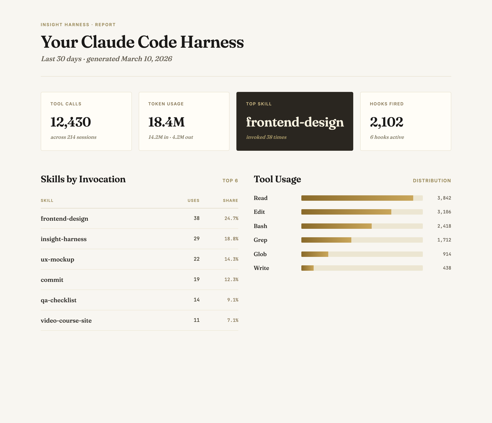

# insight-harness

> Generate a single-file HTML report of your Claude Code harness — skills, hooks, tool usage, token spend, and workflow patterns across the last 30 days.



## Use this when...

- You're curious **which skills you actually invoke** vs. the ones sitting dormant in `~/.claude/skills/`
- You want to see your **token spend and tool-usage breakdown** without digging through raw JSONL session logs
- You're tuning your harness and want to know **which hooks fire most** and how often
- You want a **superset of `/insights`** — same stats plus skills, hooks, plugins, MCP servers, and workflow phase transitions
- You want a shareable HTML file you can **upload to insightharness.com** to compare setups with other Claude Code users

## What you say to Claude

```
Run an insight-harness report on my setup.
```

Claude runs the extraction script against `~/.claude/` and opens the generated HTML in your browser. The report lands at `~/.claude/usage-data/insight-harness.html`. The script uses a strict field whitelist — it never reads tool arguments, message text, tool results, or file paths from your session logs.

## What this does and doesn't do

- **One-shot snapshot, not a daemon.** The script runs once, writes a single HTML file, and exits. It does **not** install hooks, background jobs, telemetry, or anything that keeps running after it finishes. Re-run it whenever you want a fresh snapshot; nothing changes in your harness between runs.
- **Output stays local by default.** The generated HTML lives at `~/.claude/usage-data/insight-harness.html` on your machine. It only reaches [insightharness.com](https://insightharness.com) if you choose to upload it yourself.
- **PII scrubbing runs on your machine, before anything ships.** Git name/email, OS username paths (`/Users/<you>`, `/home/<you>`), GitHub URLs containing your username, and `@<you>` mentions are replaced with placeholders in the extraction script itself — not on the server. You can open the HTML and inspect every string before uploading.
- **Shareable content is opt-out at the skill level.** Any skill with `repo: private` or `repo: none` in its SKILL.md frontmatter is excluded entirely — not just the README + hero, but the invocation count itself, so a private skill never appears in the report at all. Skills without that flag ship their README and hero image by default. Pass `--no-include-skills` to strip README + hero data from every skill in a single run. **Review your hero images before uploading** — the scrubber can't read pixels.

## Install

```bash
# From the claude-toolkit repo
./install.sh --skills insight-harness             # into current project
./install.sh --global --skills insight-harness    # into ~/.claude (all projects)
```

Or install and run in one line without cloning the repo:

```bash
mkdir -p ~/.claude/skills/insight-harness/scripts && \
curl -sL https://raw.githubusercontent.com/craigdossantos/claude-toolkit/main/skills/insight-harness/SKILL.md \
  -o ~/.claude/skills/insight-harness/SKILL.md && \
curl -sL https://raw.githubusercontent.com/craigdossantos/claude-toolkit/main/skills/insight-harness/scripts/extract.py \
  -o ~/.claude/skills/insight-harness/scripts/extract.py && \
open "$(python3 ~/.claude/skills/insight-harness/scripts/extract.py)"
```

After install, Claude will invoke this skill automatically when you mention "insight harness", "harness profile", "my setup", or "what skills do I use". New to skills? See the [main README](../../README.md#what-is-a-skill) for a one-minute primer.

## What you'll see

- **Top-line stat cards** — total tool calls, input/output token usage, top skill by invocation, hooks fired
- **Skills by invocation** — which skills you actually reach for, ranked with percent share
- **Tool usage breakdown** — Read, Edit, Bash, Grep, Glob, Write with counts
- **Workflow phase distribution** — exploration, implementation, testing, shipping, orchestration across sessions
- **Phase and tool transitions** — most common sequences (e.g. `Read -> Edit`, `exploration -> implementation`) with "test-before-ship" discipline stats
- **Full inventory** — installed plugins, configured hooks, MCP servers, permission modes, models used

## See also

- [`ux-mockup`](../ux-mockup/README.md) — another "the deliverable is one HTML file" skill, for stakeholder design review
- [`video-course-site`](../video-course-site/README.md) — a third HTML-as-output skill, for turning course videos into a readable static site
